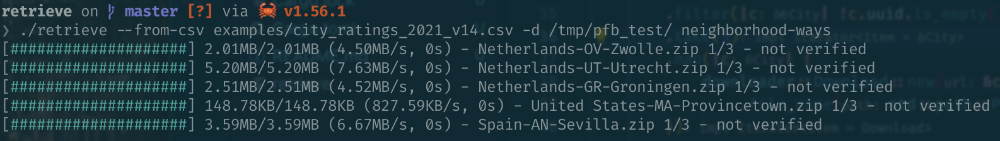

# Retrieve

Retrieve PFB datasets.

## Description

`retrieve` is a CLI tool aiming at simplifiying the process to retrieve
PeopleForBikes datasets.

Several datasets are downloaded concurently (25 by default), and the progress is
reported on the screen as a progress bar for each file, including the estimated
time left to completion.



## Usage

Retrieve the "neighborhood-ways" datasets for the list of cities specified in
a CSV file:

```bash
retrieve --from-csv examples/city_ratings_2021_v14.csv -d /tmp/pfb_test/ neighborhood-ways
```
